# 📚 DSA Visualizer

An interactive **Data Structures and Algorithms (DSA) Visualizer** developed using **HTML, CSS, and JavaScript**. This project helps students understand fundamental data structures and algorithms through interactive animations, real-time operations, and visual representations.

---

## 🚀 Features

### 📘 Linear Data Structures

* Array
* Stack
* Queue
* Linked List

### 🌳 Non-Linear Data Structures

* Binary Search Tree (BST)
* AVL Tree
* Heap
* Graph

### 🔍 Searching Algorithms

* Linear Search
* Binary Search

### ⚡ Graph Algorithms

* Breadth First Search (BFS)
* Depth First Search (DFS)

---

## ✨ Highlights

* Interactive Visualizations
* Smooth Animations
* Dark / Light Mode
* Operation History
* Statistics Panel
* Time & Space Complexity
* Responsive Design
* Modern User Interface
* Professional Dashboard Layout

---

## 🛠 Technologies Used

* HTML5
* CSS3
* JavaScript (ES6)

---

## 📂 Project Structure

```
DSA-Visualizer/
│
├── index.html
├── loader.html
├── linear.html
├── nonlinear.html
├── algorithms.html
├── array.html
├── stack.html
├── queue.html
├── linkedlist.html
├── bst.html
├── avl.html
├── heap.html
├── graph.html
│
├── css/
├── js/
├── images/
│
├── README.md
└── LICENSE
```

---

## ▶️ How to Run

1. Download or clone this repository.
2. Open the project folder.
3. Launch `loader.html` or `index.html` in your browser.
4. Explore the visualizers and interact with different operations.

---

## 📸 Modules

* Home Dashboard
* Linear Data Structures
* Non-Linear Data Structures
* Algorithms
* Array Visualizer
* Stack Visualizer
* Queue Visualizer
* Linked List Visualizer
* BST Visualizer
* AVL Tree Visualizer
* Heap Visualizer
* Graph Visualizer

---

## 🎯 Learning Objectives

* Understand DSA concepts visually.
* Learn algorithm execution step by step.
* Compare time and space complexities.
* Improve problem-solving skills.


## 📸 Screenshots

### Home

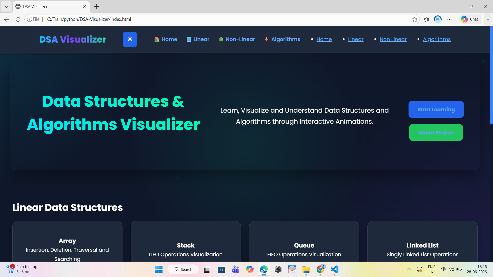

---

### Linear

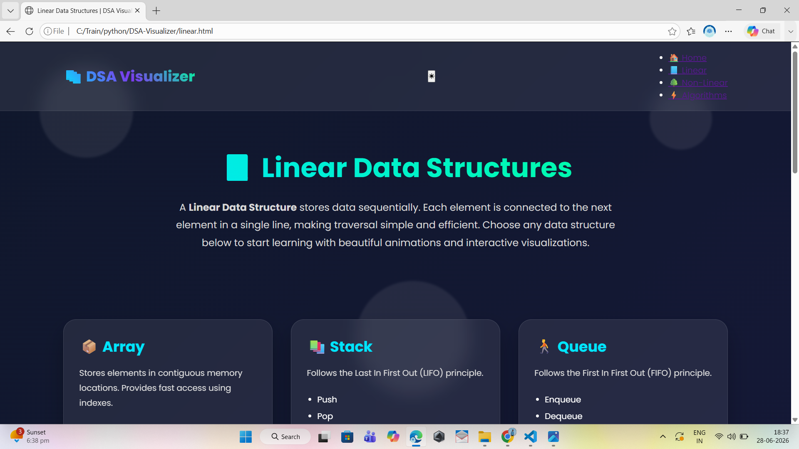

---

### Non-Linear

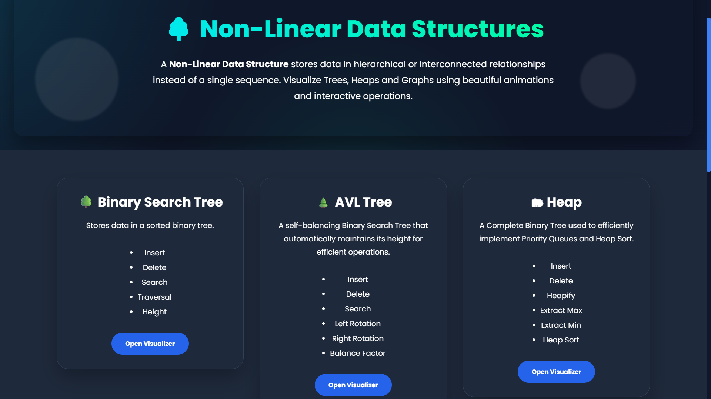

---

### Algorithms

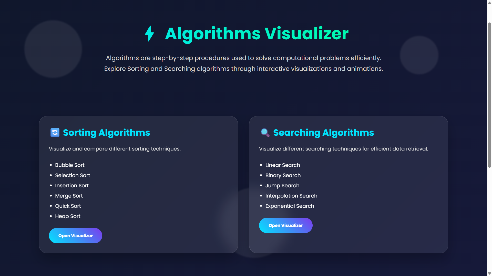

---

### Array

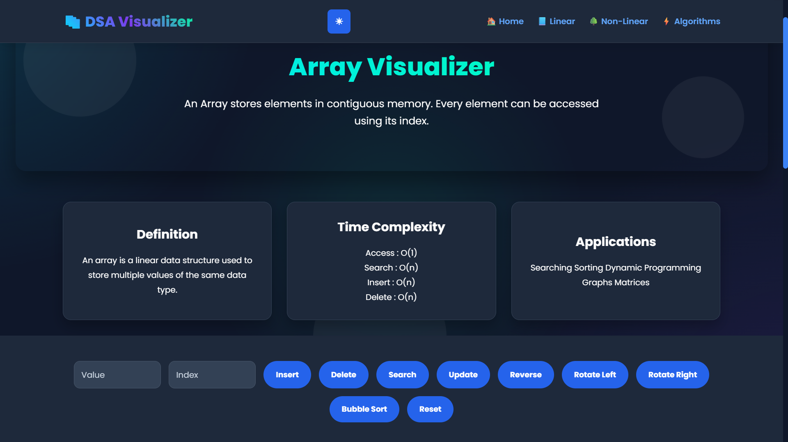

---

### Stack

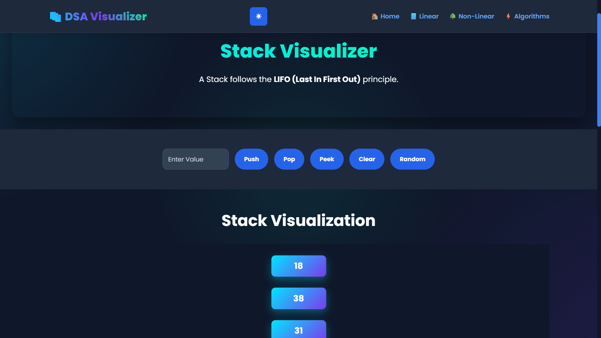

---

### Queue

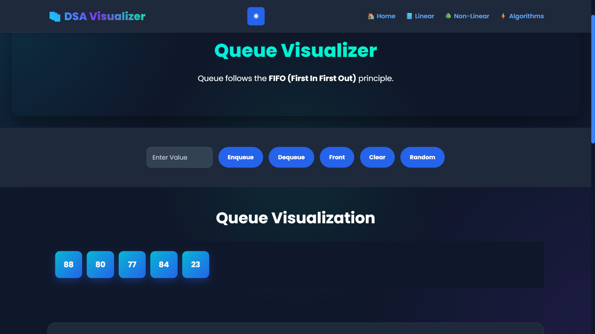

---

### Linked List

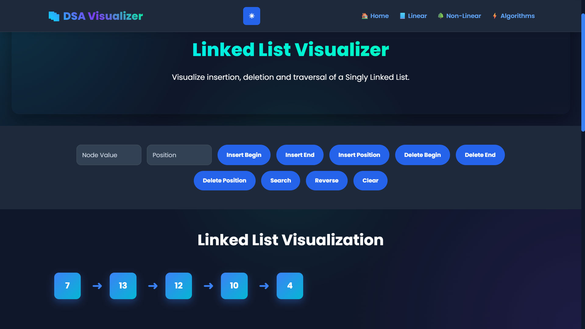

---

### BST

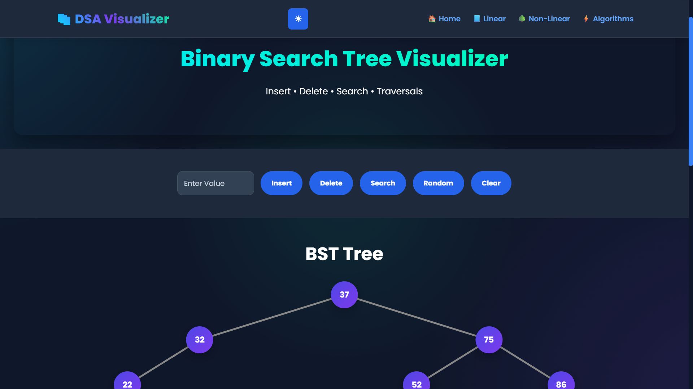

---

### AVL

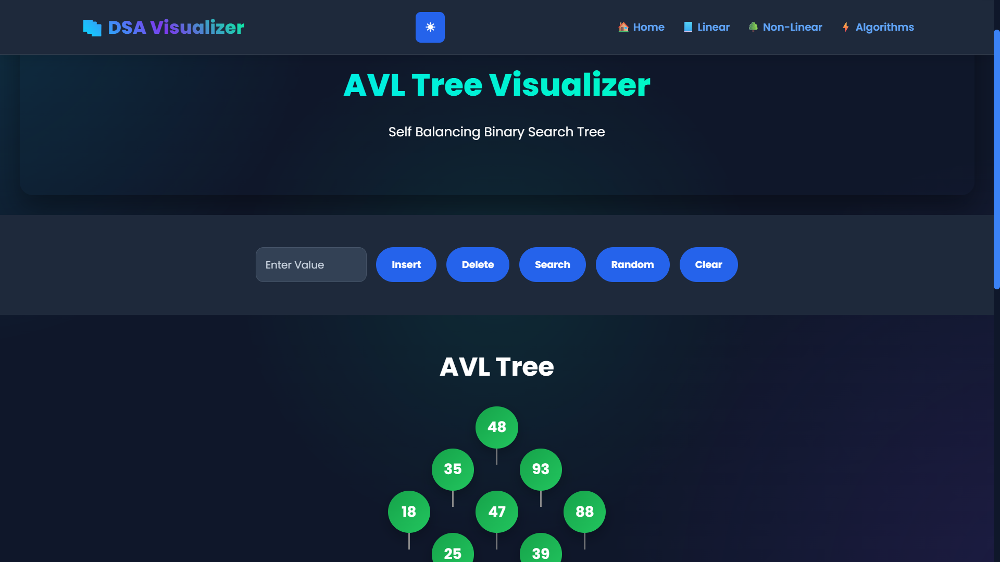

---

### Heap

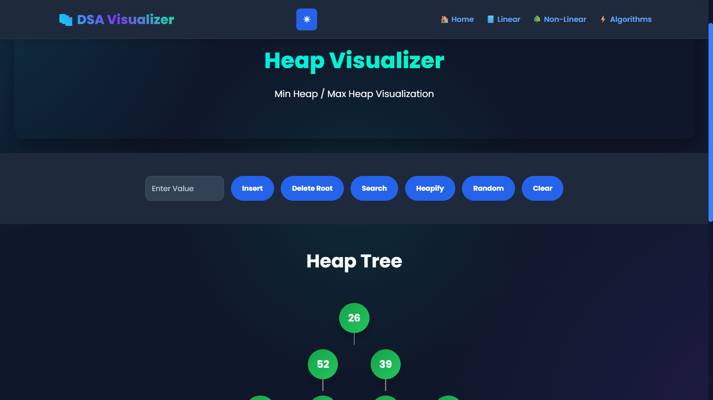

---

### Graph

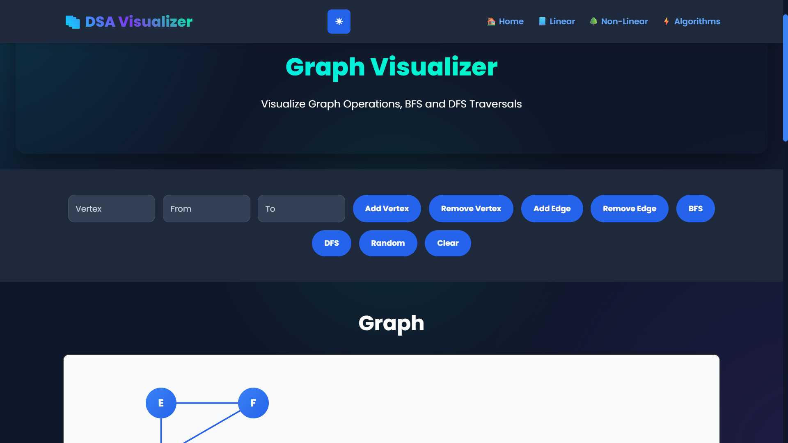

---

## 👨‍💻 Developed By

**Rahul Abbireddy**

---

## 📄 License

This project is licensed under the **MIT License**.
